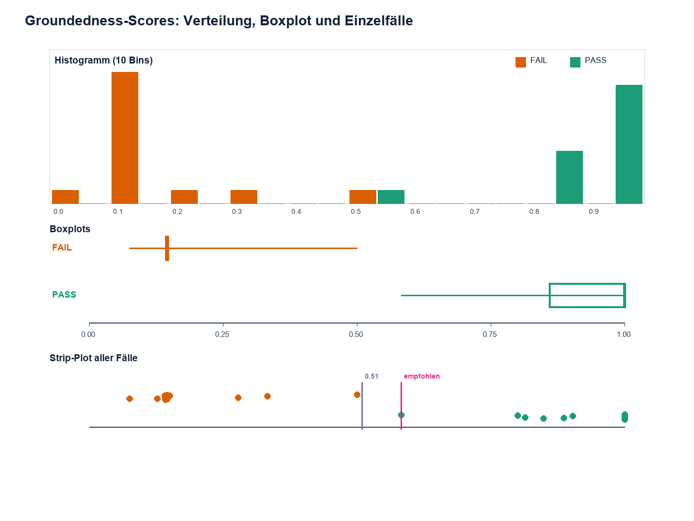
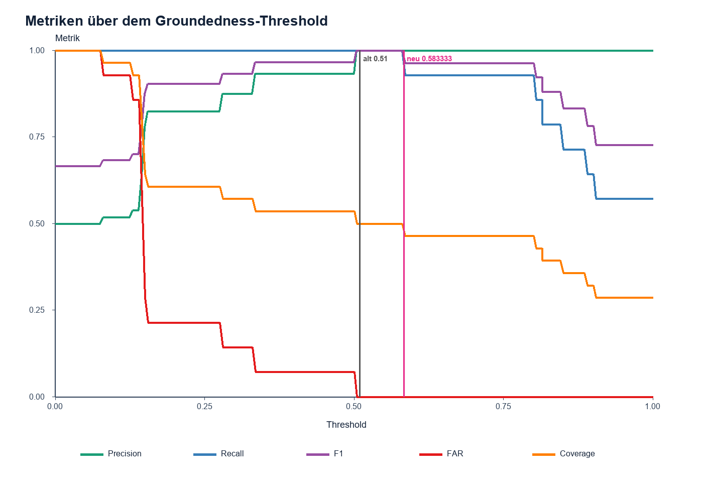
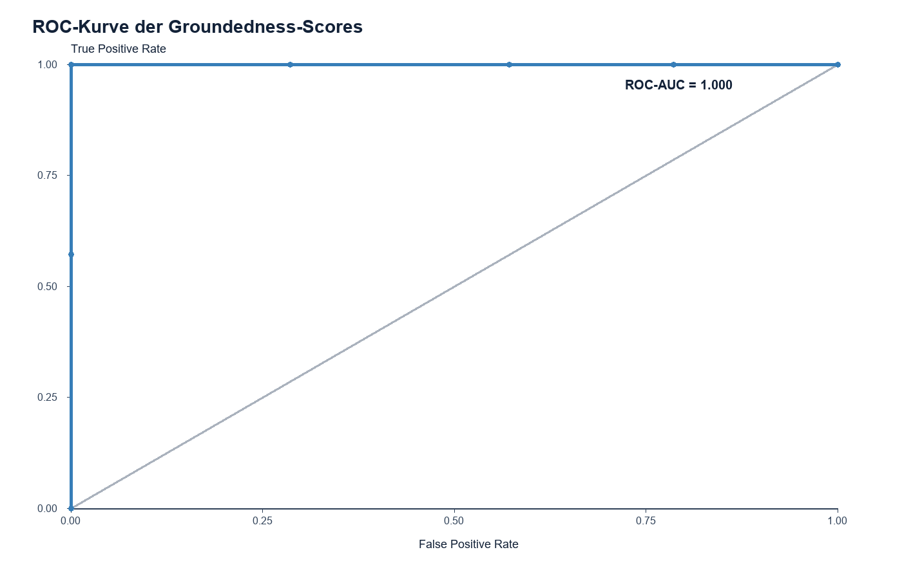
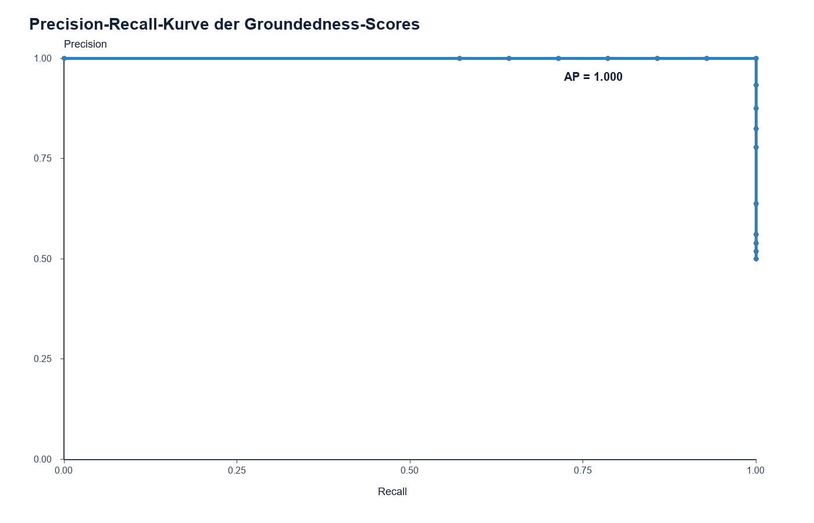
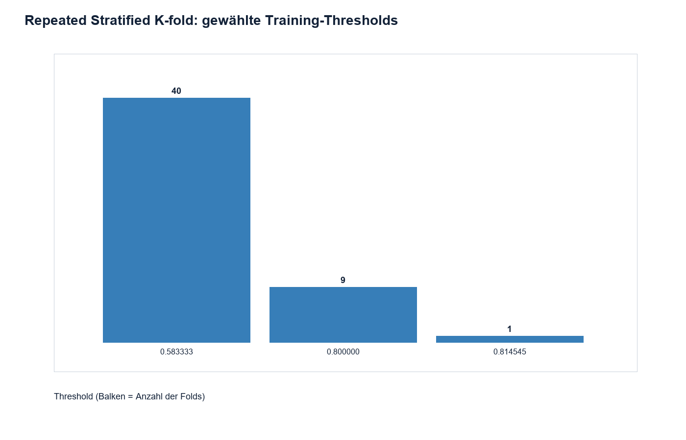

# Wissenschaftliche Kalibrierung des Groundedness-Thresholds

Erstellt: `2026-08-01T19:58:10.373122+00:00`  
Algorithmus: `fact_aware_claim_support_v4`  
Quell-Datensatz: `tests/fixtures/groundedness_calibration_cases.json`

## 1. Executive Summary

**Statistisch berechnet:** Der risikobeschränkte Threshold auf dem gesamten
Kalibrierungsset beträgt **0.583333**. Er erzielt
auf den 28 vorhandenen Fällen FAR=0.0%,
Precision=100.0%, Recall=100.0% und
F1=100.0%. Der alte Threshold 0,51 erzeugt auf diesen Fällen
dieselben Entscheidungen. Der neue Wert ist numerisch konservativer, aber im
vorliegenden Sample praktisch nicht anders.

**Status:** `provisional empirically calibrated threshold`, nicht final
statistisch validiert. Es gibt kein unangetastetes Testset, die 28 Fälle sind
synthetisch, die Human-Annotation-Provenienz ist nicht dokumentiert und die
14 FAIL-Fälle enthalten keine expliziten Criticality-Labels. Selbst bei null
False Acceptances beträgt die obere einseitige 95%-Clopper-Pearson-Grenze der
FAR 19.3% und liegt damit deutlich über 5%.

## 2. Ziel und Scope

Ziel ist ein projektspezifischer Cutoff für die Entscheidung
`score >= threshold -> ACCEPT`. Falsche Akzeptanz ist im Versicherungsfall
schwerwiegender als falsche Ablehnung. Die projektspezifische empirische
Risikogrenze ist FAR <= 5%; bestätigte kritische Versicherungsfehler dürfen
nie akzeptiert werden. Die Untersuchung ist isoliert: kein `/api/ask`, kein
Retrieval, kein Reindex, keine Embeddings, kein CRM, keine Antwortgenerierung
und kein Self-Check.

Methodische Orientierung: Sarmah et al., *How to Choose a Threshold for an
Evaluation Metric for Large Language Models*, arXiv:2412.12148v1. Die Arbeit
fordert eine explizite Use-Case-Risikoanalyse, Übersetzung der Risikotoleranz in
statistische Größen, Ground Truth, getrennte Threshold-Bestimmung und Prüfung
sowie Cross-Validation. Quelle: https://arxiv.org/abs/2412.12148v1

## 3. Aktuelle Groundedness-Implementierung

**Durch Repository-Code belegt:** `calculate_groundedness_score` in
`src/guardrails/integrations/nemo_actions.py:450` implementiert
`fact_aware_claim_support_v4`. Es gibt **kein Evaluator-Modell und keinen
Evaluator-Prompt**. Der Score ist deterministisch; Temperature, Sampling und
Modell-Seed sind nicht anwendbar.

Die Funktion:

1. entfernt Inline-Zitate und zerlegt die Antwort in Claims,
2. bildet normalisierte Tokenmengen ohne Stopwörter,
3. erkennt harte Fakten wie Policen-IDs, Daten, Zahlen, Deckungsarten und
   Selbstbeteiligung,
4. kombiniert lexikalische Claim-Abdeckung (Gewicht 0,68) mit Fact-Match
   (Gewicht 0,32),
5. bestraft fehlende harte Fakten und falsche Deckungspolarität,
6. gewichtet Dokumente leicht nach Query-Relevanz und Rang,
7. nimmt pro Claim das beste Dokument, bildet einen tokengewichteten Mittelwert,
   begrenzt ihn auf [0,1] und rundet auf sechs Stellen.

Höher bedeutet bessere dokumentarische Unterstützung. Die Implementierung ist
claim- und regelbasiert, nicht embedding-, similarity-model- oder LLM-basiert.
Die relevanten Definitionen stehen in
`src/guardrails/integrations/nemo_actions.py:108-232` und `:345-493`; die
Threshold-Anwendung steht in `:788-821`.

Groundedness wird nach Retrieval, optionalem Self-Check und Antwortgenerierung
ausgeführt (`src/api/rag_service.py:3469-3478` und `:3552-3567`). Der Self-Check
ist aktuell deaktiviert, ändert aber die Score-Funktion nicht.

## 4. Herkunft und Verwendung des bisherigen Thresholds 0.51

**Durch Artefakte belegt:** `scripts/calibrate_groundedness.py:46-86` prüfte
nur Hundertstelschritte von 0,00 bis 1,00, verlangte Recall >= 0,80, minimierte
FAR und maximierte danach F1/Recall/Precision; bei Gleichstand wurde der
niedrigste Threshold gewählt. Der höchste FAIL-Score ist 0,500000. Wegen der
inklusiven `>=`-Regel akzeptiert 0,50 diesen FAIL; 0,51 ist der erste
Hundertstelschritt darüber. Das Ergebnis wurde in
`config/groundedness_calibration.json:4` gespeichert.

`src/config/models.py:91-118` lädt dieses Artefakt; `:650-659` gibt ihm Vorrang
vor `SAFETY_MIN_GROUNDEDNESS` aus `.env`. Der `.env`-Wert 0,2 ist daher aktuell
nicht wirksam. 0,51 wurde auf denselben 28 Fällen ausgewählt und mit F1=1,0
ausgewertet. Ein unabhängiges Final Test Set existiert nicht. Das ist eine
Resubstitution mit optimistischer Bewertungsgefahr; ein externer Leak ist nicht
belegt, aber Auswahl und Evaluation sind nicht unabhängig.

Vollständige relevante Fundstellen des Literalwerts beziehungsweise seiner
produktiven Verwendung:

| Pfad | Zeile/Funktion | Bedeutung |
|---|---|---|
| `config/groundedness_calibration.json` | 4 und 14 | ausgewählter produktiver Wert und gespeicherte Metrik |
| `src/config/models.py` | 91-118, 650-659 | validiert und lädt `selected_threshold` mit Vorrang vor `.env` |
| `.env` | 44 | Fallback 0,2; wegen gültigem Kalibrierungsartefakt nicht aktiv |
| `src/guardrails/integrations/nemo_actions.py` | 788-821 | vergleicht Score mit geladenem `min_groundedness` |
| `src/api/rag_service.py` | 3600-3608 | protokolliert Score, Threshold, Quelle und Pass/Fail |
| `tests/unit/test_safety_pii_rules.py` | 17 | isolierter Test-Fixturewert 0,51 |
| `scripts/test_synthetic_customer_scenario.py` | 1479 | 0,51 als historischer Vergleichskandidat |
| `reports/groundedness_calibration_20260716_200744.md` | 8, 16, 53 | historischer Auswahlbericht |

Die vorhandenen Rohscores in `config/groundedness_calibration.json` wurden mit
der aktuellen Funktion erneut berechnet: 28
von 28 stimmen bis zur gespeicherten
Sechs-Dezimalstellen-Präzision exakt überein; maximale Abweichung
0.

## 5. Beschreibung und Qualität der Datengrundlage

Es liegen 28 balancierte, synthetische Versicherungsfälle vor: 14 PASS und 14
FAIL. Question, Context, Generated Answer, Boolean-Label und reproduzierbarer
Score sind vollständig. Die Labels sind explizit im bestehenden Fixture
gespeichert und wurden nicht aus Scores abgeleitet. Es fehlt jedoch ein Beleg,
dass Menschen die Labels annotiert oder fachlich freigegeben haben.

`error_category` und `critical` fehlen vollständig. Deshalb wurden sie nicht
ergänzt, sondern als `REVIEW_REQUIRED` normalisiert: 0 bestätigte kritische
FAIL-Fälle, 14 hinsichtlich Criticality ungeprüfte FAIL-Fälle. Für die
Sicherheitsanalyse wird zusätzlich konservativ jeder FAIL als potenziell
kritisch behandelt.

## 6. Definition von PASS, FAIL und kritischen Fehlern

PASS ist eine im Fixture als `true` gelabelte, akzeptierbare Antwort; FAIL ist
eine als `false` gelabelte Antwort. Positive Klasse = PASS. Eine False
Acceptance ist ein akzeptierter FAIL. Die explizit geforderten Kategorien
(`wrong_policy`, `wrong_deductible`, `wrong_coverage` usw.) können ohne
kuratierte Metadaten nicht verlässlich fallweise ausgewertet werden.

## 7. Projektspezifische Risikotoleranz

Empirisches Ziel: FAR <= 5%. Zusätzliche Bedingung: null kritische False
Acceptances. Mit nur 14 Negativen kann die FAR nur in Schritten von 7,14
Prozentpunkten variieren; deshalb erzwingt FAR <= 5% bereits FP=0 und erfüllt
zugleich die Worst-Case-Bedingung, wenn jeder FAIL als kritisch betrachtet wird.
Diese 5%-Grenze ist eine Projektannahme, keine regulatorische Vorgabe.

## 8. Methodik der Threshold-Suche

Kandidaten sind 0, 1, alle eindeutigen Scores, Mittelpunkte benachbarter Scores
und ein Kontrollsweep in 0,001-Schritten. Pro Kandidat wurden TP, FP, TN, FN,
FAR, FRR, Precision, Recall, Specificity, F1, Balanced Accuracy, G-mean,
Coverage und Clopper-Pearson-Intervalle berechnet.

## 9. Begründung der primären Auswahlregel

Die Regel wurde exakt in dieser Reihenfolge umgesetzt:

1. Ausschluss jedes Thresholds mit akzeptiertem FAIL im konservativen
   Worst-Case-Criticality-Szenario.
2. Ausschluss bei FAR > 5%.
3. Maximaler Recall.
4. Tie-Breaker: höhere Precision, kleinere FAR, geringere CV-F1-Streuung,
   höhere Coverage, schließlich der höhere (konservativere) Threshold.

Der Worst-Case-Schritt vermeidet erfundene Criticality-Labels. Maximum F1 oder
G-mean allein bildet die asymmetrische Versicherungsrisikotoleranz nicht ab.

## 10. Explorative Score-Analyse

| Klasse | n | Minimum | Maximum | Mittel | Median | SD |
|---|---:|---:|---:|---:|---:|---:|
| PASS | 14 | 0.583333 | 1.000000 | 0.916878 | 1.000000 | 0.122910 |
| FAIL | 14 | 0.075556 | 0.500000 | 0.186661 | 0.145714 | 0.110959 |

Es gibt in diesem Sample keine Überlappung: höchster FAIL=0,500000,
niedrigster PASS=0,583333, Trennlücke=0,083333. Kein FAIL liegt bei oder über
0,51 und kein PASS darunter. Diese perfekte Trennung ist angesichts der
synthetischen Konstruktion nicht als Produktionsnachweis zu interpretieren.
Shapiro-Wilk ergibt PASS p=0.0008048 und FAIL
p=0.0001768; Normalität ist für die stark gebündelten
Scores nicht plausibel. Z-score wurde daher nicht als Auswahlmethode verwendet.

## 11. Vergleich aller Candidate Thresholds

Die vollständigen 1028 Kandidaten stehen in
`reports/groundedness_threshold_all_candidates.csv`.

## 12. Vergleich mit Maximum F1, G-mean, Youden J und ROC

| Methode | Threshold | TP | FP | TN | FN | FAR | Precision | Recall | F1 | G-mean | Coverage | potenziell kritische FA | FAR 95%-Obergrenze |
|---|---:|---:|---:|---:|---:|---:|---:|---:|---:|---:|---:|---:|---:|
| Risk-constrained | 0.583333 | 14 | 0 | 14 | 0 | 0.000 | 1.000 | 1.000 | 1.000 | 1.000 | 0.500 | 0 | 0.193 |
| Maximum F1 | 0.583333 | 14 | 0 | 14 | 0 | 0.000 | 1.000 | 1.000 | 1.000 | 1.000 | 0.500 | 0 | 0.193 |
| Maximum G-mean | 0.583333 | 14 | 0 | 14 | 0 | 0.000 | 1.000 | 1.000 | 1.000 | 1.000 | 0.500 | 0 | 0.193 |
| Youden J | 0.583333 | 14 | 0 | 14 | 0 | 0.000 | 1.000 | 1.000 | 1.000 | 1.000 | 0.500 | 0 | 0.193 |
| ROC bei FPR <=5% | 0.583333 | 14 | 0 | 14 | 0 | 0.000 | 1.000 | 1.000 | 1.000 | 1.000 | 0.500 | 0 | 0.193 |
| Precision-Recall (max F1) | 0.583333 | 14 | 0 | 14 | 0 | 0.000 | 1.000 | 1.000 | 1.000 | 1.000 | 0.500 | 0 | 0.193 |
| Bisher 0.51 | 0.510000 | 14 | 0 | 14 | 0 | 0.000 | 1.000 | 1.000 | 1.000 | 1.000 | 0.500 | 0 | 0.193 |

Alle Vergleichsmethoden landen wegen der perfekten Trennlücke bei derselben
Klassifikation. Die risikobeschränkte Methode bleibt konzeptionell vorzuziehen,
weil sie die FAR-Grenze und kritische Fehler explizit vor der Nutzenoptimierung
anwendet. KDE, GAM und Conformal Prediction wurden bei n=28 nicht als primäre
Methoden eingesetzt; die Dichte- bzw. Kalibrierungsschätzungen wären instabil.

ROC-AUC=1.000, Average Precision=1.000.

## 13. Ergebnisse der Repeated Stratified Cross-Validation

Verwendet wurden K=5, 10 Wiederholungen und Seed
20260801. Der Threshold wurde in jedem Fold ausschließlich auf dem
Trainingsteil gewählt und danach auf dem Testteil gesperrt ausgewertet.

| Größe | Ergebnis |
|---|---:|
| Median Threshold | 0.583333 |
| Mean Threshold | 0.626957 |
| SD | 0.088156 |
| Minimum / Maximum | 0.583333 / 0.814545 |
| IQR | 0.000000 |
| Mean Test-FAR | 0.000 |
| Mean Test-Precision | 1.000 |
| Mean Test-Recall | 0.920 |
| Mean Test-F1 | 0.949 |
| Mean Test-Coverage | 0.459 |
| Folds mit potenziell kritischer FA | 0 / 50 |
| Folds mit FAR <=5% | 100.0% |

Die Threshold-Spannweite entsteht maßgeblich durch einen einzigen niedrig
scorenden PASS-Grenzfall: Liegt er im Testfold, steigt der nur auf Training
bestimmte Threshold. Das zeigt begrenzte Threshold-Stabilität trotz perfekter
Gesamtdatentrennung. Pro Testfold gibt es nur zwei oder drei FAIL-Fälle; dessen
FAR kann daher nur 0%, 33,3% oder 50% usw. annehmen.

## 14. Konfidenzintervalle und statistische Unsicherheit

Beim empfohlenen Threshold wurden 0 von 14 FAIL akzeptiert. Empirische FAR =
0%, aber die obere einseitige 95%-Clopper-Pearson-Grenze beträgt
19.3%. Das empirische 5%-Ziel ist erfüllt,
das statistisch abgesicherte Ziel (obere Grenze <=5%) nicht.

Precision=100.0%; zweiseitiges 95%-Clopper-Pearson-Intervall
[76.8%, 100.0%].
Die Intervalle quantifizieren Binomialunsicherheit, nicht Dataset-Shift,
Labelqualität oder Abhängigkeiten zwischen synthetischen Fällen.

## 15. Vergleich des empfohlenen Thresholds mit 0.51

| Variante | Threshold | TP | FP | TN | FN | FAR | Precision | Recall | F1 | G-mean | Coverage | potenziell kritische FA | FAR 95%-Obergrenze |
|---|---:|---:|---:|---:|---:|---:|---:|---:|---:|---:|---:|---:|---:|
| Alt | 0.510000 | 14 | 0 | 14 | 0 | 0.000 | 1.000 | 1.000 | 1.000 | 1.000 | 0.500 | 0 | 0.193 |
| Empfohlen | 0.583333 | 14 | 0 | 14 | 0 | 0.000 | 1.000 | 1.000 | 1.000 | 1.000 | 0.500 | 0 | 0.193 |

0,51 erfüllt auf dem Sample FAR <=5% und akzeptiert keinen FAIL; mangels
Criticality-Labels ist die wörtliche Aussage zu *bestätigten* kritischen Fehlern
nicht möglich. Im Worst-Case akzeptiert 0,51 keinen potenziell kritischen FAIL.
Der empfohlene Wert ist höher und damit numerisch konservativer, aber zwischen
0,500000 und 0,583333 existiert kein beobachteter Fall; der praktische
Unterschied auf diesen Daten ist null. 0,51 wurde auf denselben Fällen gewählt,
auf denen F1=1,0 berichtet wurde. Das ist keine unabhängige Validierung.

## 16. Kritische Fehlerszenarien

Die Fälle enthalten semantisch offensichtliche Beispiele falscher
Selbstbeteiligungen, Policen-IDs, Deckungsarten und Statusangaben. Da Kategorien
und Criticality aber nicht als Ground Truth gespeichert sind, werden keine
Einzelfallzuordnungen behauptet. Vor Produktionseinsatz ist eine fachliche
Doppelannotation erforderlich. Bis dahin ist die Worst-Case-Regel FP=0 die
einzige belegbare konservative Behandlung.

## 17. Einschränkungen

1. Nur 28 synthetische und sprachlich relativ einfache Fälle.
2. Keine dokumentierte menschliche Label-Provenienz.
3. Keine expliziten Fehlerkategorien oder Criticality-Labels.
4. Kein unabhängiges Testset; Auswahl und Full-set-Metriken nutzen dieselben Fälle.
5. Perfekte Trennung kann aus der Testkonstruktion statt Generalisierung folgen.
6. Nur ein Groundedness-Algorithmus und keine Produktionsdrift untersucht.
7. CV-Folds enthalten nur zwei bis drei negative Testfälle.

## 18. Empfohlener Threshold

**Empfehlung:** `0.583333` als
**provisional empirically calibrated threshold** für
`fact_aware_claim_support_v4`. Er ist der höchste beobachtete Kandidat, der
alle PASS-Fälle akzeptiert und alle FAIL-Fälle zurückweist. Der produktive Wert
wurde im Rahmen dieser Untersuchung **nicht geändert**.

## 19. Status: provisional oder validated

**Provisional.** Das empirische Risikoziel ist im Kalibrierungsset und in allen
CV-Testfolds erfüllt. Die statistisch abgesicherte FAR-Grenze, fachlich
verifizierte Criticality und unabhängige Generalisierung sind nicht belegt.

## 20. Konkrete nächste Schritte

1. Bestehende 28 Fälle durch zwei unabhängige Versicherungsfachpersonen prüfen;
   Konflikte adjudizieren und Label-Provenienz dokumentieren.
2. `error_category` und `critical` explizit annotieren.
3. Ein unangetastetes Hold-out mit mindestens 200 Fällen anlegen: 100 PASS und
   100 FAIL, alle kritischen Kategorien mit mindestens fünf Fällen vertreten,
   verschiedene Produkte, Sprachen, Claim-Längen und Hard Negatives. Bei 100
   FAIL kann selbst ein beobachteter Fehler noch eine einseitige 95%-Obergrenze
   von ungefähr 4,7% erlauben; der Threshold muss vor der einmaligen Auswertung
   gesperrt werden.
4. Danach Drift- und Subgruppenanalysen durchführen. Groundedness sollte
   fachliche Policy-/Customer-Konsistenzprüfungen ergänzen, nicht ersetzen.

## Reproduzierbare Falltabelle

| case_id | Label | Score | Fehlerkategorie | kritisch |
|---|---|---:|---|---|
| supported_motor_full_answer | PASS | 1.000000 | REVIEW_REQUIRED | REVIEW_REQUIRED |
| supported_motor_paraphrase | PASS | 0.814545 | REVIEW_REQUIRED | REVIEW_REQUIRED |
| supported_contract_identifier | PASS | 1.000000 | REVIEW_REQUIRED | REVIEW_REQUIRED |
| supported_deductible | PASS | 0.886667 | REVIEW_REQUIRED | REVIEW_REQUIRED |
| supported_exclusion | PASS | 0.800000 | REVIEW_REQUIRED | REVIEW_REQUIRED |
| supported_liability | PASS | 0.848889 | REVIEW_REQUIRED | REVIEW_REQUIRED |
| supported_coverage_dates | PASS | 0.902857 | REVIEW_REQUIRED | REVIEW_REQUIRED |
| supported_home_deductible | PASS | 1.000000 | REVIEW_REQUIRED | REVIEW_REQUIRED |
| supported_travel_limit | PASS | 1.000000 | REVIEW_REQUIRED | REVIEW_REQUIRED |
| supported_dental_percentage | PASS | 1.000000 | REVIEW_REQUIRED | REVIEW_REQUIRED |
| supported_two_claims_with_citation | PASS | 1.000000 | REVIEW_REQUIRED | REVIEW_REQUIRED |
| supported_short_numeric_answer | PASS | 1.000000 | REVIEW_REQUIRED | REVIEW_REQUIRED |
| unsupported_wrong_motor_deductible | FAIL | 0.141667 | REVIEW_REQUIRED | REVIEW_REQUIRED |
| unsupported_wrong_contract_identifier | FAIL | 0.145714 | REVIEW_REQUIRED | REVIEW_REQUIRED |
| unsupported_wrong_coverage_type | FAIL | 0.141667 | REVIEW_REQUIRED | REVIEW_REQUIRED |
| unsupported_reversed_coverage | FAIL | 0.150000 | REVIEW_REQUIRED | REVIEW_REQUIRED |
| unsupported_zero_deductible | FAIL | 0.127500 | REVIEW_REQUIRED | REVIEW_REQUIRED |
| unsupported_rental_car_extension | FAIL | 0.333333 | REVIEW_REQUIRED | REVIEW_REQUIRED |
| unsupported_wrong_policy_dates | FAIL | 0.145714 | REVIEW_REQUIRED | REVIEW_REQUIRED |
| unsupported_wrong_home_deductible | FAIL | 0.145714 | REVIEW_REQUIRED | REVIEW_REQUIRED |
| unsupported_wrong_baggage_limit | FAIL | 0.141667 | REVIEW_REQUIRED | REVIEW_REQUIRED |
| unsupported_wrong_dental_percentage | FAIL | 0.145714 | REVIEW_REQUIRED | REVIEW_REQUIRED |
| unsupported_mixed_extra_claim | FAIL | 0.500000 | REVIEW_REQUIRED | REVIEW_REQUIRED |
| unsupported_cancellation_claim | FAIL | 0.277875 | REVIEW_REQUIRED | REVIEW_REQUIRED |
| supported_customer_association | PASS | 0.583333 | REVIEW_REQUIRED | REVIEW_REQUIRED |
| supported_concise_coverage | PASS | 1.000000 | REVIEW_REQUIRED | REVIEW_REQUIRED |
| unsupported_liability_distractor_answer | FAIL | 0.141135 | REVIEW_REQUIRED | REVIEW_REQUIRED |
| unsupported_information_missing | FAIL | 0.075556 | REVIEW_REQUIRED | REVIEW_REQUIRED |
