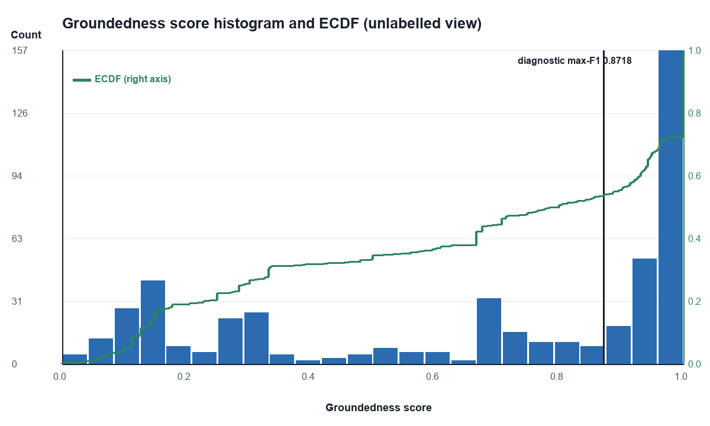
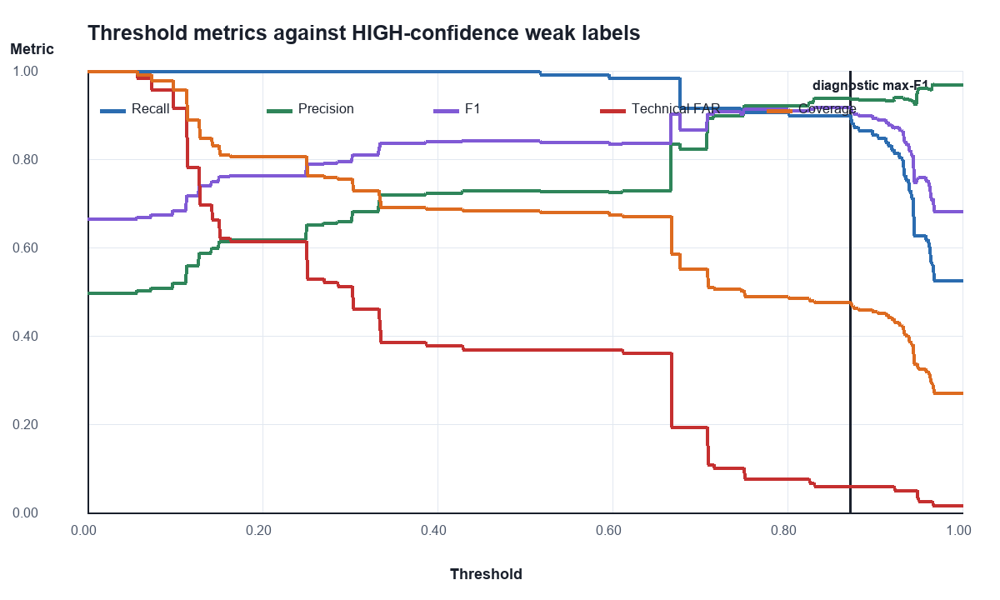
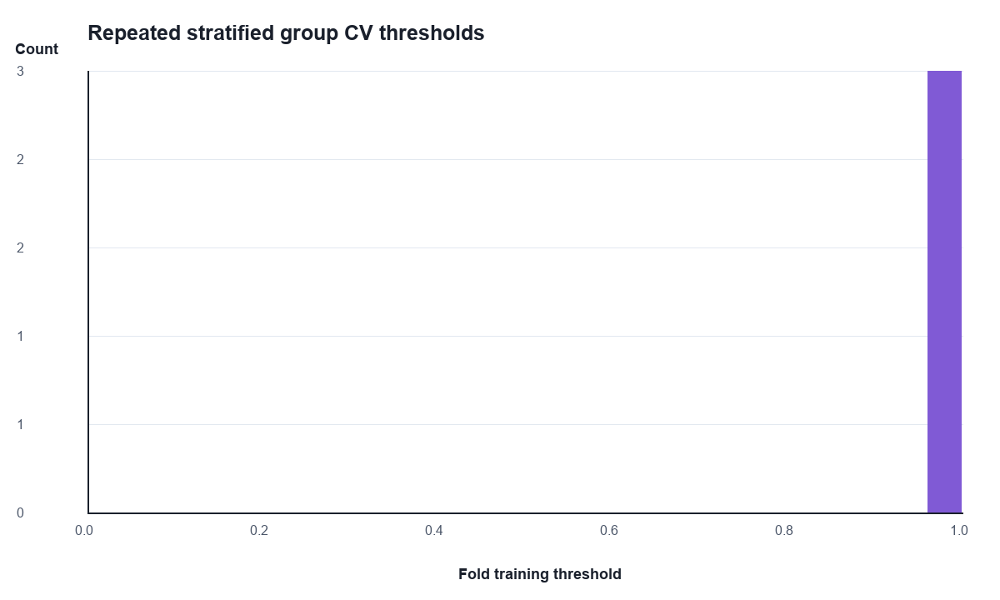
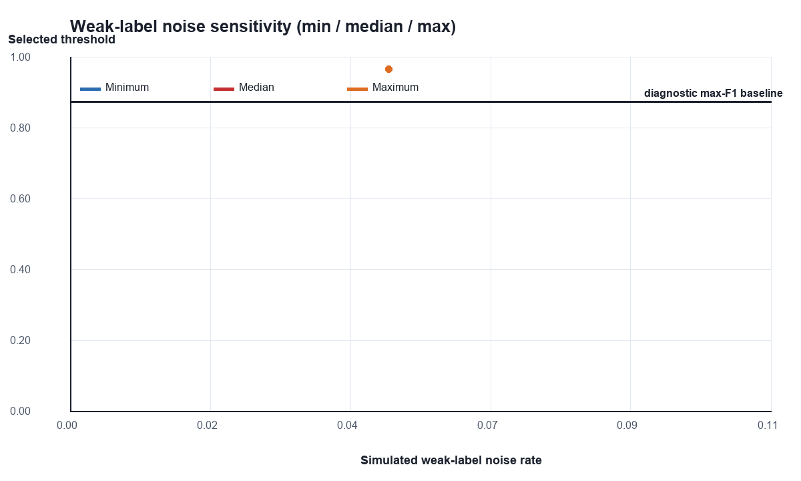

# Vorläufige Groundedness-Threshold-Kalibrierung mit Weak Supervision

## 1. Executive Summary

**Wissenschaftlicher Status:** `provisional weakly supervised threshold`.
Es wurde kein menschliches Ground Truth verwendet. Die technische Konstruktion
der Fälle dient ausschließlich als Weak Label.

Primäres Ergebnis: **no recommended threshold**. Status:
`NO_RECOMMENDED_THRESHOLD`. Die produktive Konfiguration wurde nicht geändert.

## 2. Ziel und Scope

Untersucht wird der deterministische Score `fact_aware_claim_support_v4` auf
gespeicherten Tripeln aus Question, Context und Candidate Answer. Kein Retrieval,
kein LLM, kein CRM, kein Self-Check und kein API-Endpunkt wurden aufgerufen.

## 3. Warum kein menschliches Ground Truth vorliegt

Reviewer 1, Reviewer 2 und Adjudication sind weiterhin leer. Keine menschlichen
Labels oder Criticality-Werte wurden ergänzt. Alle Leistungsmetriken sind daher
**conditional on weak labels**.

## 4. Definition von Weak Labels

`generator_expected_label=PASS` ist die technische positive Klasse;
`generator_expected_label=FAIL` die technische negative Klasse. Der Score wurde
nicht zur Labelerzeugung verwendet. Entscheidung: `score >= threshold -> ACCEPT`.

## 5. Datenquellen

Durch Repository-Artefakte belegt: InsuranceQA, aktive Helvetia-PDFs,
ausgeschlossene Baloise-Distraktoren, synthetische CRM-/Policendaten und 28
Legacy-Fälle. Details stehen im Source Audit.

## 6. Candidate- und Split-Struktur

- Kandidaten: 498
- Calibration / Validation / Preliminary Hold-out: 277 / 88 / 133
- Technische PASS / FAIL: 234 / 264
- Leakage Groups: 149

## 7. Leakage-Schutz

Der Split wurde vor dem Scoring mit SHA-256-Hashes und allen Fallzuordnungen
eingefroren. Es gibt 0 gruppenübergreifende
Splitverletzungen. Cross-Validation verwendet ausschließlich `leakage_group_id`.

## 8. Quality Flags und Duplikate

- Quality-Flag-Fälle: 15
- Exact-Duplicate-Cluster: 7
- Near-Duplicate-Paare: 319
- HIGH / MEDIUM / LOW / EXCLUDE_FROM_PRIMARY: 376 / 114 / 1 / 7

Nichtkanonische exakte Duplikate werden nicht primär gewichtet; alle Rohfälle
bleiben dokumentiert.

## 9. Groundedness-Implementierung

Durch Repository-Code belegt: `calculate_groundedness_score` und
`fact_aware_claim_support_v4`. 25 Fälle
wurden wiederholt berechnet; maximale absolute Abweichung:
0.0.

## 10. Weak-Label-Confidence

HIGH erfordert vollständige Quellen- und Mutationsprovenienz ohne Quality Flag
oder Duplikatunsicherheit. MEDIUM markiert nachvollziehbare Konstruktionen mit
semantischer Restunsicherheit. LOW verlangt Review. EXCLUDE_FROM_PRIMARY enthält
defekte oder nichtkanonische Duplikate. Dies ist technische Klassifikation, keine
fachliche Bewertung.

## 11. Primäre Kalibrierungsmenge

Nur Calibration, HIGH, technisch vollständig, ohne exakte Duplikatcluster und
ohne Fehler wurde primär verwendet: n=237.

## 12. Explorative Score-Analyse

ROC-AUC gegen Weak Labels: 0.9581;
Average Precision: 0.9451.

## 13. Unsupervised Score-Analyse

Unabhängig von Labels: 184 eindeutige Scores,
Median 0.792857. Größtes beobachtetes Gap:
`{"left": 0.628462, "right": 0.666667, "gap": 0.038205000000000044, "midpoint": 0.6475645}`.
KDE und gegebenenfalls GMM sind rein deskriptiv und kein Sicherheitsnachweis.

## 14. Threshold-Auswahlregel

1. Null akzeptierte technisch konstruierte High-Risk-Proxy-FAILs.
2. Technische FAR <= 5%.
3. Maximaler Recall.
4. Tie-Breaker: Precision, kleinere FAR, Group-CV-Stabilität, Coverage,
   höherer konservativer Threshold.

## 15. Vergleich aller Threshold-Methoden

| Methode | Threshold | TP | FP | TN | FN | FAR | Precision | Recall | F1 | Coverage | akzeptierte High-Risk-Proxies |
|---|---:|---:|---:|---:|---:|---:|---:|---:|---:|---:|---:|
| old_threshold_0_51 | 0.510000 | 118.000 | 44.000 | 75.000 | 0.000 | 36.975% | 72.840% | 100.000% | 84.286% | 68.354% | 40 |
| previous_provisional_0_583333 | 0.583333 | 117.000 | 44.000 | 75.000 | 1.000 | 36.975% | 72.671% | 99.153% | 83.871% | 67.932% | 40 |
| maximum_f1 | 0.871795 | 106.000 | 7.000 | 112.000 | 12.000 | 5.882% | 93.805% | 89.831% | 91.775% | 47.679% | 7 |
| precision_recall_maximum_f1 | 0.871795 | 106.000 | 7.000 | 112.000 | 12.000 | 5.882% | 93.805% | 89.831% | 91.775% | 47.679% | 7 |
| maximum_g_mean | 0.871795 | 106.000 | 7.000 | 112.000 | 12.000 | 5.882% | 93.805% | 89.831% | 91.775% | 47.679% | 7 |
| youden_j | 0.871795 | 106.000 | 7.000 | 112.000 | 12.000 | 5.882% | 93.805% | 89.831% | 91.775% | 47.679% | 7 |
| roc_fpr_le_5pct | 0.957500 | 74.000 | 3.000 | 116.000 | 44.000 | 2.521% | 96.104% | 62.712% | 75.897% | 32.489% | 3 |

## 16. Ergebnisse auf Calibration

Da die primäre risikobeschränkte Regel keinen gültigen Threshold liefert, werden die folgenden Split-Metriken ausschließlich am diagnostischen Maximum-F1-Vergleichspunkt 0.871795 gezeigt. Dieser Wert ist keine Empfehlung.

| Calibration HIGH (diagnostic maximum-F1 comparator; not recommended) | 0.871795 | 106.000 | 7.000 | 112.000 | 12.000 | 5.882% | 93.805% | 89.831% | 91.775% | 47.679% | 7 |

## 17. Ergebnisse auf Validation

| Validation HIGH (diagnostic maximum-F1 comparator; not recommended) | 0.871795 | 39.000 | 3.000 | 8.000 | 2.000 | 27.273% | 92.857% | 95.122% | 93.976% | 80.769% | 3 |

## 18. Ergebnisse auf Technical Weak-Label Hold-out

Der Preliminary Hold-out wurde einmalig als **technical weak-label hold-out**
ausgewertet, nicht als finaler oder menschlich validierter Hold-out.

| Technical weak-label hold-out HIGH (diagnostic maximum-F1 comparator; not recommended) | 0.871795 | 57.000 | 3.000 | 23.000 | 4.000 | 11.538% | 95.000% | 93.443% | 94.215% | 68.966% | 3 |

## 19. Group Cross-Validation

K=5, Wiederholungen=10, Seed=20260801. Threshold Median/Mean/SD: 0.961509 / 0.963006 / 0.002593; Spanne [0.961509, 0.966000], IQR=0.002246. FAR<=5% in 66.7% der gültigen Folds; High-Risk-Proxy-FA in 100.0%. Gültige Folds: 3/50.

## 20. Source-Type-Analyse

| Source Type | n | Status | Threshold | FAR | Recall |
|---|---:|---|---:|---:|---:|
| helvetia_pdf | 47 | NOT_IDENTIFIABLE_OR_NO_VALID_THRESHOLD |  |  |  |
| insuranceqa | 61 | VALID | 0.961509 | 0.000% | 72.500% |
| legacy_synthetic | 9 | NOT_IDENTIFIABLE_OR_NO_VALID_THRESHOLD |  |  |  |
| synthetic_crm | 153 | VALID | 0.957500 | 0.000% | 50.000% |

## 21. Mutation-Type- und High-Risk-Proxy-Analyse

Die vollständigen Mutation-Type-Sensitivitäten stehen in
`reports/groundedness_weak_threshold_sensitivity.csv`. High-Risk bezeichnet ausschließlich
**technically constructed high-risk proxy cases**, keine bestätigte Criticality.

## 22. Label-Noise-Sensitivität

| Noise | erfolgreiche Läufe | Median Threshold | Minimum | Maximum | FAR | Recall | Anteil mit Entscheidungsänderung |
|---|---:|---:|---:|---:|---:|---:|---:|
| 1pct | 0 | None | None | None | None | None | 0.0 |
| 5pct | 1 | 0.966 | 0.966 | 0.966 | 0.01680672268907563 | 0.559322033898305 | 1.0 |
| 10pct | 0 | None | None | None | None | None | 0.0 |

„Materiell“ bedeutet hier ohne willkürliche numerische Grenze: Mindestens ein
ursprünglicher Calibration-Fall ändert ACCEPT/REJECT.

## 23. Vergleich mit 0.51

Siehe Tabelle in Kapitel 15. Der Vergleich ist statistisch gegen Weak Labels,
nicht gegen menschliches Ground Truth.

## 24. Vergleich mit 0.583333

Siehe Tabelle in Kapitel 15. Auch 0.583333 bleibt ein früher vorläufiger Wert.

## 25. Empfohlener Threshold oder Recommended Range

**no recommended threshold**. Begründung: The current groundedness score does not provide sufficient separation under the available weak labels..
Bootstrap-Intervall conditional on weak labels:
[0.896552,
1.0].

## 26. Grenzen der Aussagekraft

1. Konstruktionserwartungen können semantisch falsch liegen.
2. Keine unabhängige fachliche Doppelannotation.
3. Confidence und High-Risk sind technische Proxies.
4. Konfidenzintervalle konditionieren auf Weak Labels und erfassen keinen Label-Bias.
5. Source-Familien und synthetische Vorlagen können trotz Gruppierung Dataset-Shift verursachen.

## 27. Voraussetzungen für spätere Human Validation

Zwei unabhängige Reviewer, Konfliktadjudikation, finale Leakage-sichere
Holdout-Bildung, erneutes isoliertes Scoring und genau eine finale
Human-Ground-Truth-Holdout-Auswertung.

## 28. Konkrete Empfehlung zur produktiven Verwendung

Keine automatische Produktivänderung. Der Wert beziehungsweise Bereich darf nur
als Forschungs- und Shadow-Evaluation-Referenz verwendet werden. Der bestehende
Produktionswert bleibt unverändert, bis menschliche Validierung abgeschlossen ist.

---

No human ground truth was used. The result is a provisional weakly supervised threshold and must not be interpreted as a final human-validated production threshold.
